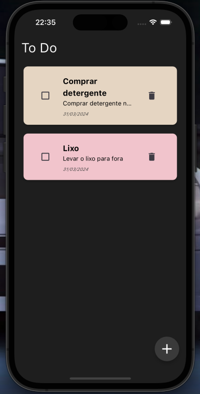

 <h1 align="center">
    To Do
</h1>

<p align="center">
  <a href="https://dart.dev/">
    
  </a>
  <a href="https://flutter.dev/">
    
  </a>
  <a href="https://supabase.com/">
    
  </a>
</p>

## To Do

- [About](#about)
- [The Application](#application)
- [Techs](#techs)
- [Clone and use for Free](#clone)

<a id="about"></a>

## About

<strong>To Do:</strong> App designed to save your daily tasks

<a id="application"></a>

## The Application

<h3 align="center">
    
    
    
</h3>


<a id="techs"></a>

## Techs

The project was developed with the technologies below:

- [Dart](https://dart.dev/)
- [Flutter](https://flutter.dev/)
- [Supabase](https://supabase.com/)

<a id="clone"></a>

## Clone this repo

1. Clone :

```sh
  $ git clone https://github.com/Augustob790/To_Do.git
```

2. Go to folder:

```sh
  $ cd to_do_list
```

3. Execute in terminal:

```sh
  $ flutter pub get && flutter run      
```

## License

This project is under MIT LICENSE. for more details follow the link: [LICENSE](LICENSE).


